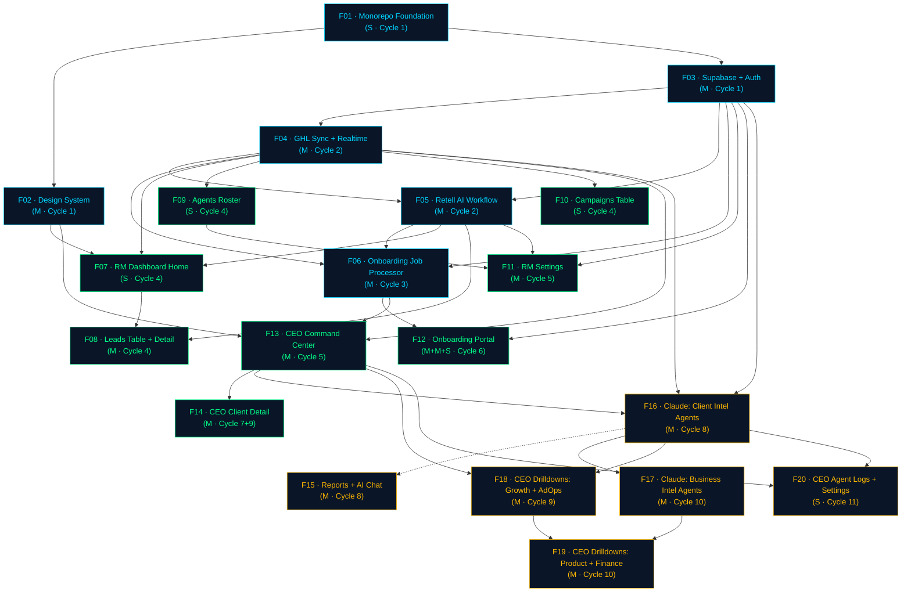

# FEATURE-DEPENDENCIES.md
# MIRD AI Corporate Machine — Feature Dependency Graph
# Step 10 / Phase F
# Date: 2026-04-02 | Status: ✅ Complete

---

## Dependency Types

| Symbol | Meaning |
|---|---|
| `-->` | Hard dependency — target cannot start until source is deployed |
| `-.->` | Soft dependency — target can ship with stub/empty state; source enriches it |
| `==>` | Data dependency — source populates the data that target displays |

---

## Master Dependency Graph (Mermaid)



---

## Dependency Matrix

`●` = hard dependency | `◐` = soft/data dependency | blank = no dependency

| | F01 | F02 | F03 | F04 | F05 | F06 | F07 | F08 | F09 | F10 | F11 | F12 | F13 | F14 | F15 | F16 | F17 | F18 | F19 | F20 |
|---|---|---|---|---|---|---|---|---|---|---|---|---|---|---|---|---|---|---|---|---|
| **F01** | | | | | | | | | | | | | | | | | | | | |
| **F02** | ● | | | | | | | | | | | | | | | | | | | |
| **F03** | ● | | | | | | | | | | | | | | | | | | | |
| **F04** | | | ● | | | | | | | | | | | | | | | | | |
| **F05** | | | ● | ● | | | | | | | | | | | | | | | | |
| **F06** | | | ● | ● | ● | | | | | | | | | | | | | | | |
| **F07** | | ● | | ● | ● | | | | | | | | | | | | | | | |
| **F08** | | | | | ● | | ● | | | | | | | | | | | | | |
| **F09** | | | | ● | | | | | | | | | | | | | | | | |
| **F10** | | | | ● | | | | | | | | | | | | | | | | |
| **F11** | | | ● | | ● | | | | ● | | | | | | | | | | | |
| **F12** | | | ● | | | ● | | | | | | | | | | | | | | |
| **F13** | | ● | | ● | | ● | | | | | | | | | | | | | | |
| **F14** | | | | | | | | | | | | | ● | | | | | | | |
| **F15** | | | | | | | | | | | | | | | | ◐ | | | | |
| **F16** | | | ● | ● | | | | | | | | | ● | | | | | | | |
| **F17** | | | | | | | | | | | | | | | | ● | | | | |
| **F18** | | | | | | | | | | | | | ● | | | ● | | | | |
| **F19** | | | | | | | | | | | | | | | | | ● | ● | | |
| **F20** | | | | | | | | | | | | | ● | | | ● | | | | |

---

## Critical Path Analysis

The critical path is the longest dependency chain — the sequence that cannot be parallelized and determines the minimum possible time to R1/R2.

### Critical Path to R0 Complete
```
F01 → F03 → F04 → F05 → F06
(1wk)  (2wk)  (2wk)  (2wk)  (2wk) = ~9 weeks minimum
```
Parallel track: `F01 → F02` (design system) runs alongside F03, no delay on critical path.

### Critical Path to R1 Complete
```
F01 → F03 → F04 → F05 → F06 → F12 → [R1 complete]
```
The onboarding portal (F12) is the longest R1 pitch (M+M+S = ~5 weeks) and sits at the end of the F06 dependency. It is the **gating deliverable for R1**.

Parallel tracks in R1 (can run after F06):
- Track A: `F07 → F08` (dashboard + leads)
- Track B: `F09 → F11` + `F10` (agents + settings + campaigns)
- Track C: `F13 → F14` (CEO core)

### Critical Path to R2 Complete
```
F03 → F04 → F16 → F17 → F19 → [R2 complete]
```
F17 (Business Intel Agents) requires Stripe (BE-11 included in F17), making it the longest R2 dependency chain. F19 (Finance drilldown) reads from F17's output — this is the **gating deliverable for R2**.

---

## Parallel Execution Opportunities

| Window | Tracks That Can Run Simultaneously |
|---|---|
| **Cycle 1** | F02 (design system) ∥ F03 (Supabase auth) — both depend only on F01 |
| **Cycle 4** | F07 ∥ F09 ∥ F10 — all depend on F04; F07 starts, F09+F10 start same cycle |
| **Cycle 5** | F11 ∥ F13 — Settings and CEO Command Center share no dependencies |
| **Cycle 8** | F16 runs first week → F15 starts same cycle after first F16 run |
| **Cycle 9** | F14 R2 tabs ∥ F18 — Client detail remaining tabs and Growth drilldown are independent |
| **Cycle 10** | F17 (Agents) ∥ F19 part 1 — Product drilldown (no Stripe) can start before Finance agent |

---

## Dependency Risk Table

| Risk | Affected PRDs | Mitigation |
|---|---|---|
| F03 (auth) delayed → blocks everything | F04–F20 (all) | F03 is Cycle 1, highest priority bet. No R1 pitch starts until F03 is deployed. |
| F06 (job processor) delayed → blocks onboarding | F12 | F12 can be built and tested with mock provisioning responses; requires F06 live before E2E test |
| F16 delayed → F15 has no data | F15 | F15 ships with empty state (countdown to first report). No hard block, just empty UI. |
| F17 (Stripe) delayed → Finance agent blocked | F17, F19 | Finance drilldown (F19) stubs MRR from `metrics` table instead of Stripe until F17 live. Finance tab in F14 stubs invoice data. |
| External API changes (Retell, Meta, Google) | F05, F10, F12b | All external API calls isolated in server actions + n8n workflows — single update point. |

---

## Deployment Dependencies (Infrastructure Order)

Before any PRD can be deployed to production, these infrastructure items must exist:

| # | Infrastructure | Required By | Notes |
|---|---|---|---|
| 1 | Supabase project created | F03 | One project, multiple schemas (public + auth) |
| 2 | Vercel teams + 3 app projects | F01 | `dashboard`, `ceo`, `onboarding` — separate Vercel projects |
| 3 | n8n instance running | F04 | Self-hosted or n8n Cloud |
| 4 | GHL sub-account template | F05, F06 | MIRD template sub-account to clone for new clients |
| 5 | Retell AI account + default agent | F05 | Default agent template configured |
| 6 | Resend account + domain verified | F06, F16 | Email delivery for welcome + weekly reports |
| 7 | Stripe account + webhook endpoint | F17 | Subscription + invoice management |
| 8 | Anthropic API key | F15, F16, F17 | Claude API access (claude-sonnet-4-5+) |
| 9 | Apollo API key | F17 | Prospect data sync |
| 10 | `rainmachine.io` domain DNS | F07 | `app.rainmachine.io` → Vercel dashboard app |
| 11 | `onboard.rainmachine.io` DNS | F12 | Onboarding portal Vercel app |
| 12 | `ceo.rainmachine.io` DNS | F13 | CEO app Vercel project |
