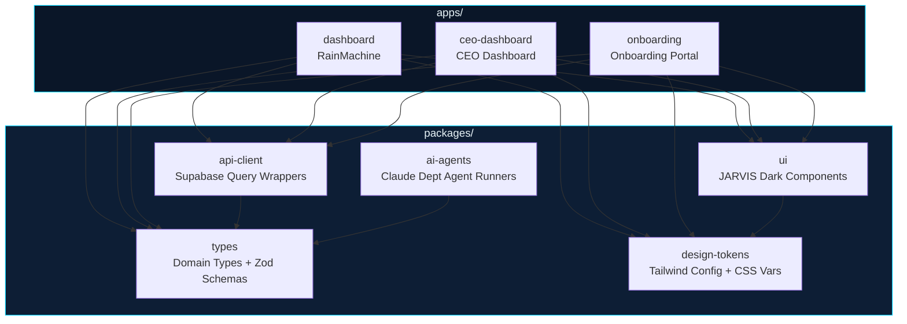
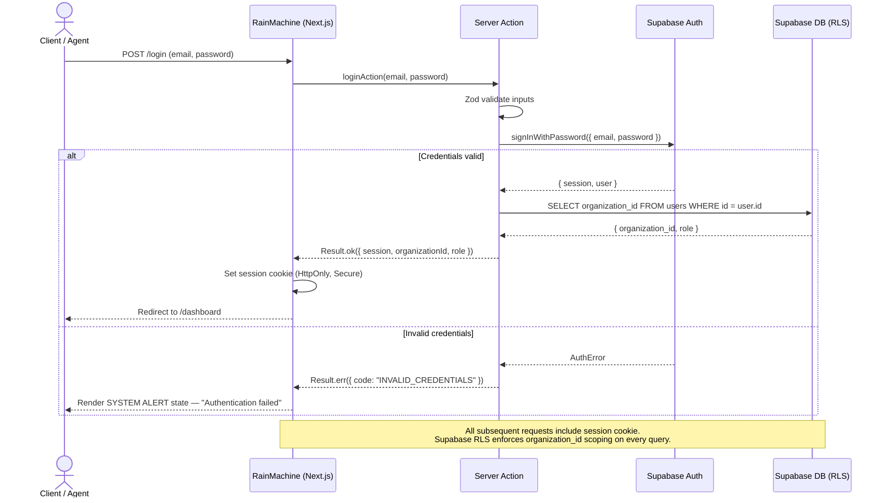
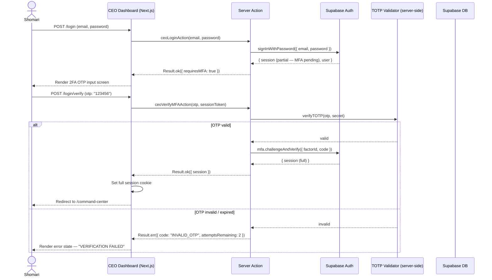
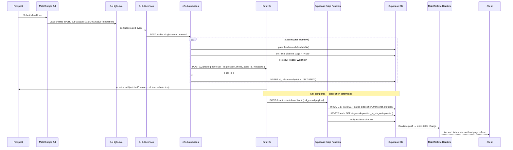
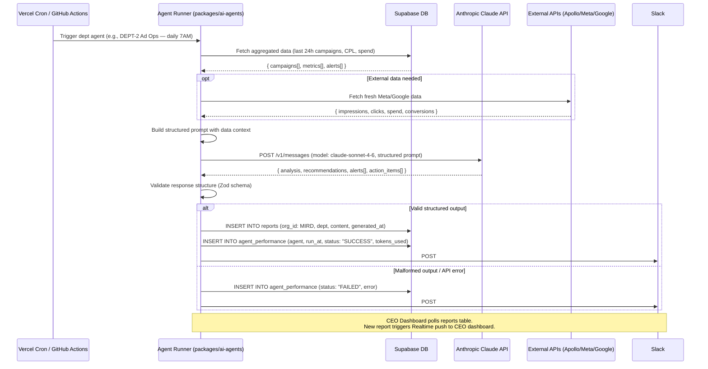
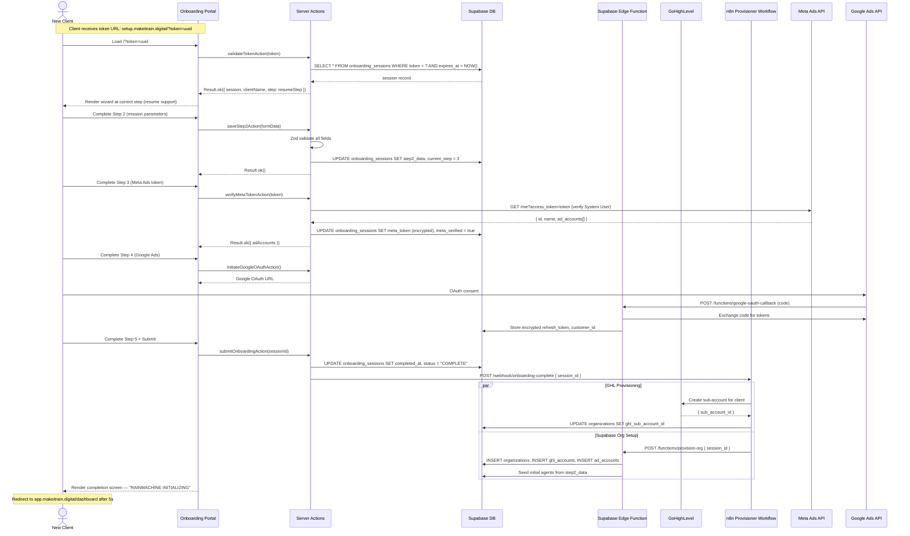
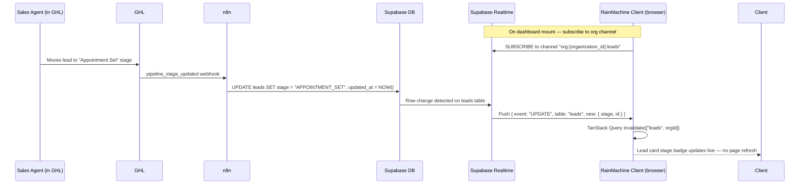

# MIRD AI Corporate Machine — Architecture Diagrams
## Step 8 | Date: 2026-03-31

All diagrams are in Mermaid format. Render in any Mermaid-compatible viewer (GitHub, Notion, VS Code extension).

---

## Diagram Index

| # | Diagram | Type | Section |
|---|---------|------|---------|
| 1 | System Context | C4 Context | Phase A |
| 2 | Container Architecture | C4 Container | Phase B |
| 3 | Monorepo Package Graph | Dependency graph | Phase B |
| 4 | Auth Flow — RainMachine | Sequence | Phase B |
| 5 | Auth Flow — CEO Dashboard (2FA) | Sequence | Phase B |
| 6 | Lead Ingestion Flow | Sequence | Phase B |
| 7 | Claude Agent Cron Flow | Sequence | Phase B |
| 8 | Onboarding Provisioning Flow | Sequence | Phase B |
| 9 | Supabase Realtime Update Flow | Sequence | Phase B |
| 10 | ERD — All Entities | Entity-Relationship | Phase D |

---

## Diagram 1 — System Context (C4 Level 1)

See `/docs/tech/TECHNICAL-SPEC.md` Section 1.5.

---

## Diagram 2 — Container Architecture (C4 Level 2)

```mermaid
C4Container
    title MIRD AI Corporate Machine — Container Architecture

    Person(shomari, "Shomari", "MIRD founder/CEO")
    Person(client, "Client + Agents", "RainMachine users")
    Person(newClient, "New Client", "Onboarding token holder")

    Container_Boundary(monorepo, "Turborepo Monorepo (mird-ai-corporate-machine)") {
        Container(dashboard, "RainMachine Dashboard", "Next.js 15, App Router", "Client CRM — leads, campaigns, agents, reports, settings")
        Container(ceo, "CEO Dashboard", "Next.js 15, App Router", "Internal ops — KPIs, Claude outputs, client health, P&L")
        Container(ob, "Onboarding Portal", "Next.js 15, App Router", "5-step new-client wizard — token auth, ad account connections")
        Container(pkgUI, "packages/ui", "React + Tailwind v4", "Shared JARVIS Dark component library — 13 components")
        Container(pkgTypes, "packages/types", "TypeScript", "Shared domain types, Zod schemas, Result<T,E> pattern")
        Container(pkgAPIClient, "packages/api-client", "TypeScript", "Typed wrappers for Supabase queries and Edge Function calls")
        Container(pkgTokens, "packages/design-tokens", "CSS + TS", "JARVIS Dark v1.0 design tokens as Tailwind config + CSS vars")
    }

    Container_Boundary(supabaseCloud, "Supabase Cloud") {
        ContainerDb(db, "PostgreSQL 16", "Supabase", "Multi-tenant database — all MIRD application data with RLS")
        Container(auth, "Supabase Auth", "Supabase", "JWT-based auth — email/password, magic link, session management")
        Container(realtime, "Supabase Realtime", "Supabase", "Live metric updates pushed to dashboard clients")
        Container(storage, "Supabase Storage", "Supabase", "File uploads — onboarding assets, report exports, creative files")
        Container(edgeFn, "Edge Functions", "Deno", "Webhook receivers (GHL, Meta, Google), server-side secrets, heavy crypto")
    }

    Container_Ext(ghl, "GoHighLevel", "SaaS CRM", "Contact/pipeline SoT — sub-accounts per client, automations, native voice agent")
    Container_Ext(n8n, "n8n", "Automation", "Cross-system orchestration: GHL → Retell → Supabase → Slack")
    Container_Ext(retell, "Retell AI", "Voice AI SaaS", "Automated voice calls — new leads and cold outbound")
    Container_Ext(claudeAPI, "Anthropic Claude API", "AI SaaS", "claude-sonnet-4-6 — powers all 4 internal department agents")
    Container_Ext(metaAPI, "Meta Marketing API", "Ad Platform API", "Campaign spend, CPL, creative performance insights")
    Container_Ext(googleAPI, "Google Ads API + GMB", "Ad Platform API", "Google campaign data, Customer Match, Business Profile")
    Container_Ext(slack, "Slack", "Messaging", "CEO notifications — #mird-alerts, #ceo-loop channels")
    Container_Ext(apollo, "Apollo.io", "Sales Intel SaaS", "Prospect database for outbound sequences")
    Container_Ext(vercel, "Vercel", "Hosting", "3 separate Next.js projects — custom domain per app, preview branches")
    Container_Ext(redis, "Upstash Redis", "Cache/Rate Limit", "Rate limiting for API routes and onboarding token validation")

    Rel(client, dashboard, "HTTPS", "browser")
    Rel(shomari, ceo, "HTTPS", "browser")
    Rel(newClient, ob, "HTTPS", "browser + token URL")

    Rel(dashboard, auth, "Auth session", "JWT")
    Rel(ceo, auth, "Auth session + 2FA", "JWT")
    Rel(ob, auth, "Token validation", "custom token")

    Rel(dashboard, db, "Server actions + queries", "Supabase client")
    Rel(ceo, db, "Server actions + queries", "Supabase client")
    Rel(ob, db, "Server actions + writes", "Supabase client")

    Rel(dashboard, realtime, "Subscribe to org channel", "WebSocket")
    Rel(ceo, realtime, "Subscribe to all-org channel", "WebSocket")

    Rel(dashboard, storage, "Upload/download files", "Supabase Storage API")
    Rel(ob, storage, "Upload onboarding assets", "Supabase Storage API")

    Rel(edgeFn, db, "Webhook data writes", "Supabase admin client")
    Rel(ghl, edgeFn, "Contact/pipeline webhooks", "HTTPS POST")
    Rel(metaAPI, edgeFn, "Ad performance webhook", "HTTPS POST")

    Rel(n8n, edgeFn, "Trigger provisioning", "HTTPS POST")
    Rel(n8n, retell, "Trigger voice call", "HTTPS POST")
    Rel(n8n, slack, "Send alerts", "Slack API")
    Rel(n8n, db, "Write synced data", "Supabase REST API")
    Rel(ghl, n8n, "GHL webhook", "HTTPS POST")

    Rel(claudeAPI, db, "Read aggregated data, write reports", "Supabase REST API (server)")
    Rel(claudeAPI, apollo, "Search prospects", "Apollo API")
    Rel(claudeAPI, slack, "Post agent outputs", "Slack API")

    Rel(dashboard, vercel, "Deployed on", "")
    Rel(ceo, vercel, "Deployed on", "")
    Rel(ob, vercel, "Deployed on", "")
```

---

## Diagram 3 — Monorepo Package Dependency Graph

---

## Diagram 4 — Auth Flow: RainMachine (Email/Password)

---

## Diagram 5 — Auth Flow: CEO Dashboard (Email + 2FA TOTP)

---

## Diagram 6 — Lead Ingestion Flow (Meta/Google Ad → RainMachine)

---

## Diagram 7 — Claude AI Department Agent Cron Flow

---

## Diagram 8 — Onboarding Provisioning Flow

---

## Diagram 9 — Supabase Realtime Dashboard Update Flow

---

*All diagrams current as of Step 8 | 2026-03-31*
