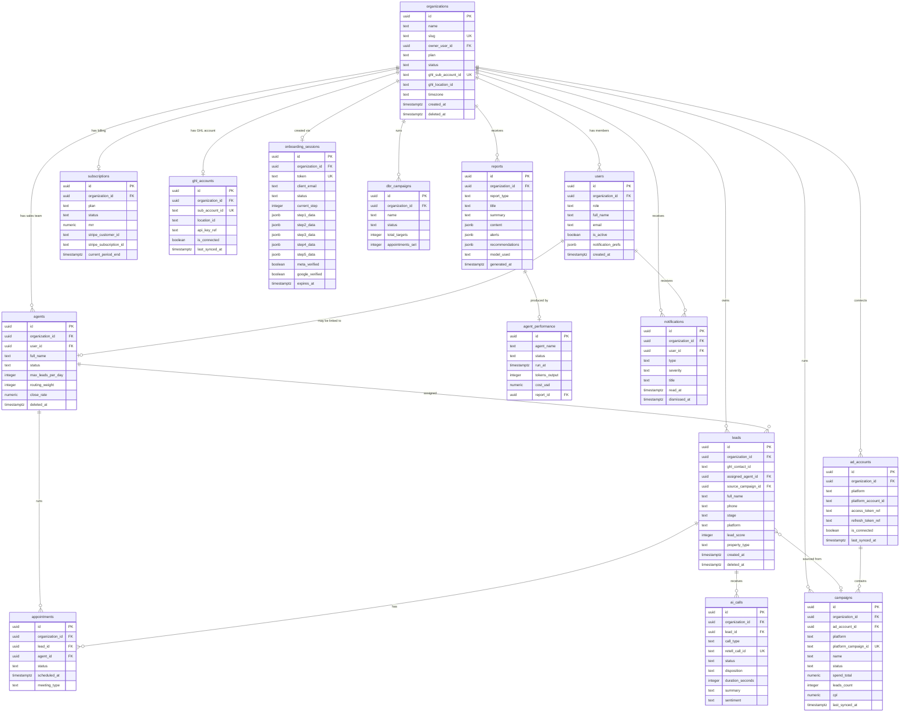

# MIRD AI Corporate Machine — Technical Specification
## Make It Rain Digital | Step 8: Technical Specification & Development Blueprint
## Version: 1.0 | Date: 2026-03-31 | Status: In Progress

> **Sigma Protocol Step 8 Output** — This is the definitive development blueprint synthesizing Steps 1–7 into implementation-ready documentation for all three MIRD applications.

---

## Document Map

| Section | Topic | Status |
|---------|-------|--------|
| 1 | Executive Technical Summary | ✅ |
| 2 | System Architecture | ✅ |
| 3 | Technology Stack | ✅ |
| 4 | Database Design | ✅ |
| 5 | API Specification | ✅ |
| 6 | Security Architecture | ✅ |
| 7 | Frontend Implementation | ✅ |
| 8 | Backend Implementation | ✅ |
| 9 | Infrastructure & Deployment | ✅ |
| 10 | Testing Strategy | ✅ |
| 11 | Development Workflow | ✅ |
| 12 | Risk Assessment | ✅ |

**Supporting files:**
- `/docs/tech/ARCHITECTURE-DIAGRAMS.md` — All Mermaid diagrams
- `/docs/tech/TECH-STACK-DETAILED.md` — Versions, ADRs, alternatives
- `/docs/tech/database/SCHEMA-COMPLETE.sql` — Full SQL schema
- `/docs/tech/api/OPENAPI-SPEC.yaml` — OpenAPI 3.1 webhook spec
- `/docs/tech/api/TYPESCRIPT-TYPES.ts` — All shared TypeScript types
- `/docs/tech/security/SECURITY-DETAILED.md` — Security controls
- `/docs/tech/implementation/FRONTEND-SPEC.md` — Frontend architecture
- `/docs/tech/implementation/BACKEND-SPEC.md` — Backend architecture
- `/docs/tech/ops/INFRASTRUCTURE.md` — Hosting, CI/CD, monitoring
- `/docs/tech/testing/TESTING-STRATEGY.md` — Test plan & coverage
- `/docs/tech/ops/DEVELOPMENT-WORKFLOW.md` — Git, tooling, process
- `/docs/tech/ops/RISK-MITIGATION.md` — Risk register & mitigations

---

# Section 1: Executive Technical Summary

## 1.1 Project Overview

Make It Rain Digital (MIRD) is an AI-powered client acquisition company serving real estate team leaders and insurance agency owners. The MIRD AI Corporate Machine is a **multi-tenant SaaS platform** composed of three production applications — a client-facing CRM dashboard (RainMachine), an internal CEO operations dashboard, and a self-service client onboarding portal — unified by a shared Supabase PostgreSQL database, a GoHighLevel CRM backbone, and four scheduled Claude AI Department Agents that autonomously operate MIRD's business.

The platform's business model requires two things simultaneously: delivering a premium, high-trust CRM product to clients (RainMachine), and giving Shomari (MIRD founder) a real-time intelligence layer over the entire business (CEO Dashboard). The architecture is built to run effectively as a **solo-operated business** with AI assistance — every design decision prioritizes operational leverage over distributed systems complexity.

## 1.2 Key Technical Decisions

| Decision | Choice | Rationale |
|----------|--------|-----------|
| **Architecture pattern** | Turborepo monorepo — 3 Next.js apps + shared packages | Shared types, design tokens, and API client with per-app deployment |
| **Frontend framework** | Next.js 15 (App Router) for all 3 apps | RSC for data-heavy pages, server actions for mutations, single mental model across apps |
| **Backend** | Supabase (primary) + Next.js server actions + Supabase Edge Functions | No separate API server — DB-first with Row-Level Security doing heavy auth lifting |
| **Database** | Supabase PostgreSQL 16 with RLS | Multi-tenancy enforced at DB level; GHL is contact SoT, Supabase is analytical SoT |
| **Contact source of truth** | GoHighLevel (GHL) | GHL owns pipeline, contacts, appointments. Supabase holds aggregates, metrics, AI outputs |
| **Automation layer** | n8n | Cross-system workflows crossing GHL → Retell AI → Supabase → Slack boundaries |
| **AI agents** | Claude API (claude-sonnet-4-6) scheduled via cron | Internal-only, never customer-facing; run on schedule, output structured reports |
| **Voice AI** | Retell AI (new leads/cold outbound) + GHL Native Voice Agent (warm contacts) | Two separate systems; never conflated |
| **Realtime** | Supabase Realtime | Live dashboard metric updates without WebSocket infrastructure |
| **Deployment** | Vercel (all 3 Next.js apps) | Per-app projects, preview branches, custom domains per app |
| **Development model** | Solo-operator with AI assistance (Turborepo + strict TypeScript) | Leverage > headcount; exhaustive typing replaces team code review |

## 1.3 The Three AI Systems (Critical Separation)

This is the most architecturally significant constraint in the entire system. These three AI systems are **never conflated** — each has a distinct trigger, audience, and purpose:

| System | Faces | Trigger | Purpose |
|--------|-------|---------|---------|
| **Retell AI** | Prospects (external) | New lead form submission, cold outbound, DBR campaigns | Voice calls — immediate AI response to new real estate leads |
| **GHL Native Voice Agent** | Warm contacts (external) | Confirmations, no-show follow-ups, inbound warm contacts | Voice calls — nurturing and confirming existing pipeline contacts |
| **Claude AI Department Agents** | Shomari / MIRD (internal) | Scheduled cron (daily/weekly) | Business operations — reporting, monitoring, prospecting, P&L |

Claude agents **never touch customer-facing interactions**. They read aggregated Supabase data and produce structured outputs surfaced in the CEO Dashboard.

## 1.4 Three-App Architecture Summary

| App | Users | URL | Layout | Primary Purpose |
|-----|-------|-----|--------|-----------------|
| **RainMachine Dashboard** | Client (e.g., Marcus) + client's agents | `app.makeitrain.digital` | 240px sidebar + 52px header | Lead tracking, campaign reporting, AI call summaries, agent management |
| **CEO Dashboard** | Shomari (MIRD only) | `ceo.makeitrain.digital` | Full-width 1440px, no sidebar | North Star KPIs, all-client command center, Claude agent outputs, P&L |
| **Onboarding Portal** | New clients (token-based, one-time) | `setup.makeitrain.digital` | Centered 720px wizard | 5-step client intake — identity, parameters, Meta/Google integrations, launch config |

## 1.5 C4 Level-1 Context Diagram

```mermaid
C4Context
    title MIRD AI Corporate Machine — System Context

    Person(shomari, "Shomari (MIRD Founder)", "CEO Dashboard user. Reviews KPIs, Claude agent outputs, client health, P&L.")
    Person(client, "Client (e.g., Marcus)", "RainMachine user. Tracks leads, campaigns, agents, AI calls.")
    Person(agent, "Client's Sales Agent", "RainMachine user. Views assigned leads, call history, appointments.")
    Person(prospect, "Real Estate Prospect", "Submits lead form via Meta/Google Ads. Receives AI voice call immediately.")
    Person(newClient, "New MIRD Client", "Completes onboarding wizard via token URL. Connects ad accounts, provides business info.")

    System(rainmachine, "RainMachine Dashboard", "Next.js 15 app. Client-facing CRM — leads, campaigns, reports, agents, settings.")
    System(ceoDash, "CEO Dashboard", "Next.js 15 app. Internal ops — all-client KPIs, Claude agent outputs, dept drilldown, P&L.")
    System(onboarding, "Onboarding Portal", "Next.js 15 app. 5-step wizard for new client setup.")

    System_Ext(supabase, "Supabase", "PostgreSQL 16 + RLS + Auth + Realtime + Edge Functions + Storage. Primary operational database.")
    System_Ext(ghl, "GoHighLevel (GHL)", "CRM backbone. Source of truth for contacts, pipeline, appointments, automations.")
    System_Ext(n8n, "n8n", "Automation layer. Orchestrates cross-system workflows.")
    System_Ext(retell, "Retell AI", "Voice AI system. Calls new leads within seconds of form submission.")
    System_Ext(claude, "Claude API (Anthropic)", "Powers 4 internal department agents running on cron schedule.")
    System_Ext(meta, "Meta Ads API", "Provides campaign spend, CPL, creative performance data.")
    System_Ext(google, "Google Ads API + GMB", "Provides Google campaign data and Google Business Profile connection.")
    System_Ext(slack, "Slack", "Receives Claude agent alerts and CEO loop notifications.")
    System_Ext(apollo, "Apollo.io", "Prospect database for Dept 1 (Growth & Acquisition) outbound sequences.")

    Rel(client, rainmachine, "Uses daily")
    Rel(agent, rainmachine, "Uses daily")
    Rel(shomari, ceoDash, "Reviews daily")
    Rel(newClient, onboarding, "Completes once via token URL")
    Rel(prospect, ghl, "Submits lead form → GHL contact created")

    Rel(rainmachine, supabase, "Reads/writes leads, campaigns, agents, reports")
    Rel(ceoDash, supabase, "Reads all-org data, Claude agent outputs, financials")
    Rel(onboarding, supabase, "Writes onboarding session, triggers provisioning")

    Rel(ghl, n8n, "Webhooks on contact/pipeline events")
    Rel(n8n, supabase, "Writes synced data, triggers updates")
    Rel(n8n, retell, "Triggers voice call for new leads")
    Rel(n8n, slack, "Posts alerts and notifications")

    Rel(claude, supabase, "Reads aggregated data, writes reports + recommendations")
    Rel(claude, apollo, "Searches prospects for Dept 1")
    Rel(claude, meta, "Reads ad performance for Dept 2")
    Rel(claude, slack, "Posts dept agent outputs")

    Rel(rainmachine, ghl, "OAuth — reads sub-account data")
    Rel(onboarding, meta, "Verifies Meta System User token")
    Rel(onboarding, google, "OAuth — connects Google Ads + GMB")
```



## 1.6 Development Timeline

### Phase 1: Foundation (Weeks 1–3)
- Turborepo monorepo scaffolding — 3 apps + shared packages
- Supabase project setup — full schema, RLS policies, seed data
- Authentication implemented for all 3 apps (Supabase Auth)
- Shared `packages/ui` — all 13 JARVIS Dark components built and tested
- Design token system (Tailwind config) from JARVIS Dark v1.0
- CI/CD pipeline (GitHub Actions → Vercel) operational for all 3 apps
- Local dev environment documented (env vars, GHL sandbox, n8n local)

### Phase 2: Core Features (Weeks 4–9)
**RainMachine (Weeks 4–6):**
- Dashboard home with live metrics (Supabase Realtime)
- Lead management — list, slide-over panel, full profile, call history
- Campaign table — Meta + Google with accordion detail
- Agent management — roster, routing diagram, performance
- Reports — archive, AI chat interface

**CEO Dashboard (Weeks 6–8):**
- Command center — all-client health grid, alert queue
- Client detail — 5-tab view (overview, campaigns, leads, timeline, financials)
- Department drilldown — 4 dept views
- Agent activity log

**Onboarding Portal (Weeks 7–9):**
- Token validation and session management
- 5-step wizard — complete flow with Meta + Google integrations
- Completion + provisioning trigger

### Phase 3: Enhancement & AI Agents (Weeks 10–14)
- Claude AI Department Agents (all 4) — prompts, cron jobs, Supabase output storage
- n8n workflows — Lead Router, Retell AI Trigger, Ad Report Sync, Onboarding Provisioner
- GHL integration — webhook handlers, sub-account provisioning
- Retell AI integration — call disposition sync back to Supabase
- Settings flows — all 9 RainMachine settings screens + CEO settings
- Performance optimization, Lighthouse CI, accessibility audit
- End-to-end testing (Playwright) — all critical paths

---

*Phase A complete. See Section 2 for System Architecture.*

---

# Section 2: System Architecture

## 2.1 Architecture Pattern: Turborepo Monorepo

### Chosen Pattern
**Modular monorepo** — one Git repository containing three independently deployable Next.js applications and five shared packages, orchestrated by Turborepo.

### Justification
The MIRD platform has three applications that share significant surface area: the same design system (JARVIS Dark), the same domain types (`Lead`, `Campaign`, `Organization`), the same Supabase query patterns, and the same authentication logic. A monorepo eliminates type drift between apps and ensures the design system is enforced uniformly — critical for a brand that charges premium pricing based on perceived quality.

The **solo-operator constraint** makes this especially important: managing three separate repos with synchronized dependencies is high-overhead work. Turborepo's remote caching means CI builds only what changed, keeping the pipeline fast.

### Alternatives Considered

| Option | Rejected Because |
|--------|-----------------|
| Three separate repos | Type drift between apps; dependency sync overhead; no shared CI cache; design token divergence over time |
| Single Next.js app (route-based separation) | Different auth models (client vs CEO vs token-based); different deployment requirements; CEO dashboard must be inaccessible to clients at the infrastructure level |
| Nx monorepo | More configuration overhead than Turborepo for this scale; Turborepo is the standard for Next.js monorepos |

### Trade-offs
| ✅ Benefits | ⚠️ Trade-offs |
|------------|--------------|
| Single source of truth for types and design tokens | Initial monorepo setup complexity |
| Turborepo remote cache — CI only rebuilds changed apps | All apps share one Node.js version |
| Atomic commits spanning all 3 apps | Must coordinate breaking changes to shared packages |
| Single `npm install` for all apps | Package graph complexity increases with new packages |

## 2.2 Repository Structure

```
mird-ai-corporate-machine/
├── apps/
│   ├── dashboard/              # RainMachine — app.makeitrain.digital
│   │   ├── app/                # Next.js App Router
│   │   │   ├── (auth)/         # Login, forgot password, reset
│   │   │   ├── (dashboard)/    # Protected dashboard routes
│   │   │   │   ├── page.tsx    # /dashboard
│   │   │   │   ├── leads/      # /leads, /leads/[id]
│   │   │   │   ├── campaigns/  # /campaigns
│   │   │   │   ├── reports/    # /reports, /reports/[id]
│   │   │   │   ├── agents/     # /agents, /agents/[id]
│   │   │   │   └── settings/   # /settings/*
│   │   │   └── layout.tsx      # Root layout with JARVIS shell
│   │   ├── components/         # App-specific components
│   │   ├── lib/                # App-specific utilities, Supabase client
│   │   └── actions/            # Server actions (organized by domain)
│   │
│   ├── ceo-dashboard/          # CEO Dashboard — ceo.makeitrain.digital
│   │   ├── app/
│   │   │   ├── (auth)/         # CEO login + 2FA
│   │   │   └── (dashboard)/
│   │   │       ├── command-center/
│   │   │       ├── clients/[id]/
│   │   │       ├── departments/[dept]/
│   │   │       ├── agent-log/
│   │   │       └── settings/
│   │   ├── components/
│   │   ├── lib/
│   │   └── actions/
│   │
│   └── onboarding/             # Onboarding Portal — setup.makeitrain.digital
│       ├── app/
│       │   ├── page.tsx        # /?token=[uuid] — token validation
│       │   └── setup/
│       │       ├── step-1/     # System initialization / identity
│       │       ├── step-2/     # Mission parameters
│       │       ├── step-3/     # Meta Ads integration
│       │       ├── step-4/     # Google Ads + GMB integration
│       │       ├── step-5/     # Launch configuration
│       │       └── complete/   # Completion + provisioning trigger
│       ├── components/
│       ├── lib/
│       └── actions/
│
├── packages/
│   ├── ui/                     # JARVIS Dark component library
│   │   ├── src/
│   │   │   ├── components/     # 13 core JARVIS components
│   │   │   ├── animations/     # Framer Motion variants
│   │   │   └── index.ts        # Barrel export
│   │   └── package.json
│   │
│   ├── types/                  # Shared TypeScript types + Zod schemas
│   │   ├── src/
│   │   │   ├── domain/         # Lead, Campaign, Agent, Organization...
│   │   │   ├── api/            # Request/response types
│   │   │   ├── result.ts       # Result<T, E> type
│   │   │   └── index.ts
│   │   └── package.json
│   │
│   ├── api-client/             # Typed Supabase query wrappers
│   │   ├── src/
│   │   │   ├── leads.ts
│   │   │   ├── campaigns.ts
│   │   │   ├── agents.ts
│   │   │   ├── reports.ts
│   │   │   └── index.ts
│   │   └── package.json
│   │
│   ├── design-tokens/          # JARVIS Dark v1.0 tokens
│   │   ├── tailwind.config.ts  # Extended Tailwind config
│   │   ├── tokens.css          # CSS custom properties
│   │   └── package.json
│   │
│   └── ai-agents/              # Claude Department Agent runners
│       ├── src/
│       │   ├── dept-1-growth.ts
│       │   ├── dept-2-ad-ops.ts
│       │   ├── dept-3-product.ts
│       │   ├── dept-4-finance.ts
│       │   └── runner.ts       # Shared agent runner + cron logic
│       └── package.json
│
├── supabase/
│   ├── migrations/             # Versioned SQL migrations
│   ├── functions/              # Edge Functions (Deno)
│   │   ├── ghl-webhook/
│   │   ├── retell-webhook/
│   │   ├── google-oauth-callback/
│   │   └── provision-org/
│   └── seed.sql
│
├── docs/                       # All Sigma Protocol outputs (Steps 1–8)
├── turbo.json                  # Turborepo pipeline config
├── package.json                # Root workspace
└── .github/workflows/          # CI/CD
```

## 2.3 Bounded Context Boundaries

Three bounded contexts map cleanly to database ownership and application responsibility. Cross-context data access is always explicit and read-only from the consumer side.

| Context | Owner App | Owns in DB | Reads From |
|---------|-----------|-----------|-----------|
| **MIRD Operations** | CEO Dashboard + AI agents | `subscriptions`, `organizations`, `agent_performance`, `reports` | All contexts (read-only aggregates) |
| **RainMachine Platform** | RainMachine Dashboard | `leads`, `appointments`, `ai_calls`, `agents`, `ghl_accounts`, `onboarding_sessions` | GHL (via n8n sync) |
| **Rainmaker Leads** | CEO Dashboard (reporting) + n8n (writes) | `campaigns`, `ad_accounts`, `dbr_campaigns` | Meta API, Google API (via n8n sync + Edge Functions) |

## 2.4 Data Flow Architecture

All sequence diagrams are in `/docs/tech/ARCHITECTURE-DIAGRAMS.md`. Summary:

| Flow | Trigger | Key Systems | Latency Target |
|------|---------|-------------|----------------|
| **Auth — RainMachine** | Login form submit | Next.js SA → Supabase Auth → DB | < 800ms |
| **Auth — CEO Dashboard** | Login + 2FA OTP | Next.js SA → Supabase Auth MFA | < 1.2s |
| **Lead ingestion** | Meta/Google form submit | GHL → n8n → Supabase + Retell AI | < 60s (Retell call initiated) |
| **Claude agent cron** | Scheduled (daily/weekly) | Agent runner → Claude API → Supabase → Slack | < 3min per agent |
| **Onboarding submit** | Wizard step 5 complete | Next.js SA → Supabase → n8n → GHL + Supabase | < 30s provisioning start |
| **Realtime metric update** | GHL pipeline stage change | n8n → Supabase → Realtime → browser | < 2s end-to-end |

## 2.5 Infrastructure Requirements

| Category | Requirement | Specification |
|----------|-------------|--------------|
| **Compute** | 3 Next.js apps | Vercel serverless functions — auto-scaling, no config |
| **Database** | PostgreSQL 16 | Supabase Pro — 8GB RAM, 100GB storage, PITR, connection pooling |
| **Edge Functions** | 4 webhook handlers | Supabase Edge Functions (Deno) — auto-scaling, global PoPs |
| **Realtime** | Live dashboard updates | Supabase Realtime — up to 200 concurrent connections (Pro) |
| **Storage** | File uploads | Supabase Storage — 100GB, CDN-backed |
| **Cache / Rate Limit** | Token + API rate limiting | Upstash Redis — serverless, 10K req/day free tier |
| **Automation** | n8n workflows | n8n Cloud (Starter) or Railway self-hosted |
| **CDN** | Static assets | Vercel Edge Network — automatic |
| **Logs** | Application logs | Better Stack (log drain from Vercel + Supabase) |
| **Errors** | Frontend + backend errors | Sentry (one project per app) |
| **Monitoring** | Web vitals + uptime | Vercel Analytics + Better Stack uptime monitors |

## 2.6 Architecture Decision Records

### ADR-001: Turborepo Monorepo
**Context:** 3 Next.js apps sharing types, design tokens, and data access patterns.
**Decision:** Single Turborepo monorepo with shared packages.
**Consequences:** ✅ Type safety across all apps, ✅ Single CI pipeline, ⚠️ Requires monorepo discipline.
**Alternatives Rejected:** Three separate repos (type drift), single Next.js app (deployment and auth model conflicts).

### ADR-002: Supabase as Primary Backend
**Context:** Solo operator needs a managed backend with auth, realtime, storage, and a powerful DB — without running a separate API server.
**Decision:** Supabase handles auth, database, realtime, storage, and edge functions. No custom Express/Hono server.
**Consequences:** ✅ Zero infrastructure to manage, ✅ RLS enforces multi-tenancy at DB level, ✅ Realtime built-in, ⚠️ Vendor lock-in on Supabase-specific features.
**Alternatives Rejected:** Custom Node.js/Hono API server (operational overhead), PlanetScale (no realtime, no auth), Neon (no edge functions).

### ADR-003: GoHighLevel as Contact Source of Truth
**Context:** GHL is the CRM, automation platform, and AI voice agent orchestrator. Syncing contacts to Supabase is needed for querying and reporting.
**Decision:** GHL owns the contact record. Supabase holds aggregated/analytical data + AI outputs. n8n syncs between them.
**Consequences:** ✅ No duplicate contact management UI, ✅ GHL automations continue to work, ⚠️ GHL API rate limits must be respected, ⚠️ Two-way sync complexity on stage changes.
**Alternatives Rejected:** Supabase as contact SoT (rebuild all GHL automation logic), abandon GHL (loses native voice agent and automation capabilities).

### ADR-004: n8n as Automation Layer
**Context:** Multiple workflows cross system boundaries (GHL → Retell AI → Supabase → Slack). These need visual debugging, retry logic, and non-developer maintainability.
**Decision:** n8n handles all cross-system orchestration. GHL handles simple single-system automations.
**Consequences:** ✅ Visual workflow editor — maintainable without code, ✅ Built-in retry + error handling, ⚠️ n8n uptime affects lead response time, ⚠️ Additional infrastructure cost.
**Alternatives Rejected:** Custom webhook handlers (no visual debugging, no retry UI), Zapier (cost at scale, limited code control), Inngest (good for code-driven but no visual editor).

### ADR-005: Claude Agents as Scheduled Workers (Never Hot Path)
**Context:** Claude API calls are expensive (~$0.003–$0.015/1K tokens) and have variable latency (2–30s). Customer-facing interactions require < 500ms response.
**Decision:** Claude agents run on cron schedules only. They never intercept real-time customer interactions. All customer-facing AI is Retell AI (voice) or GHL native agent.
**Consequences:** ✅ Zero Claude API cost on hot paths, ✅ Agent outputs are always structured + validated, ✅ Cost is predictable (4 agents × daily = fixed), ⚠️ CEO insights are batch (up to 24h old) not live.
**Alternatives Rejected:** Claude in real-time chat (latency + cost), Claude on every lead (uncontrolled cost).

---

*Phase B complete. See Section 3 for Technology Stack.*

---

# Section 3: Technology Stack

> Full detail, ADRs, and rejected alternatives in `/docs/tech/TECH-STACK-DETAILED.md`.

## 3.1 Complete Stack at a Glance

| Layer | Technology | Version | Notes |
|-------|-----------|---------|-------|
| **Monorepo** | Turborepo + pnpm | 2.3.x / 9.x | Task caching, workspace management |
| **Runtime** | Node.js | 22 LTS | Dev + build tooling |
| **Framework** | Next.js (App Router) | 15.1.x | All 3 apps — RSC + server actions |
| **Language** | TypeScript (strict) | 5.7.x | All apps + all packages |
| **UI Library** | React | 19.x | — |
| **Styling** | Tailwind CSS | 4.x | JARVIS Dark tokens via `packages/design-tokens` |
| **Animation** | Framer Motion | 11.x | State transitions; CSS for ambient loops |
| **Global State** | Zustand | 5.x | Auth, UI, notifications |
| **Server State** | TanStack Query | 5.x | All async data — caching + invalidation |
| **Forms** | React Hook Form + Zod | 7.54.x / 3.24.x | All forms, all apps |
| **Icons** | Lucide React | 0.468.x | Full icon set |
| **Headless UI** | Radix UI Primitives | latest | Modals, popovers, select, tooltip |
| **Database** | Supabase PostgreSQL | 16.x | Multi-tenant, RLS enforced |
| **Auth** | Supabase Auth | 2.x | JWT — email/password + magic link + MFA |
| **Realtime** | Supabase Realtime | 2.x | Live dashboard pushes |
| **Storage** | Supabase Storage | 1.x | Files, assets |
| **Edge Functions** | Supabase (Deno) | Deno 1.x | Webhooks, secrets, heavy crypto |
| **DB Client** | Supabase JS | 2.47.x | No ORM — direct client + generated types |
| **AI Agents** | Anthropic Claude API | claude-sonnet-4-6 | 4 internal dept agents, cron-only |
| **AI SDK** | Anthropic TS SDK | 0.36.x | Agent runner |
| **Voice AI** | Retell AI | v2 | New leads + cold outbound |
| **Automation** | n8n | 1.x | Cross-system workflows |
| **Rate Limiting** | Upstash Redis | 1.x | Token validation, API rate limits |
| **Hosting** | Vercel | — | All 3 Next.js apps (separate projects) |
| **CI/CD** | GitHub Actions | — | lint → type-check → test → build → deploy |
| **Errors** | Sentry | 8.x | One project per app |
| **Logs** | Better Stack | — | Log drain + uptime monitoring |
| **Analytics** | Vercel Analytics | — | Web vitals + RUM |
| **Testing** | Vitest + Playwright + MSW | 2.x / 1.x / 2.x | Unit + E2E + API mocking |

## 3.2 Stack Profile Decision Summary

The stack is **server-first** (Next.js RSC + server actions) backed by a **managed cloud backend** (Supabase) with **no custom API server**. This is the highest-leverage configuration for a solo operator building a premium multi-tenant SaaS product.

### Why This Beats Alternatives for MIRD

| Alternative Stack | Why Rejected |
|------------------|-------------|
| Next.js + Express API + Prisma | Extra server to deploy/maintain; Prisma migration system conflicts with Supabase; no built-in realtime |
| TanStack Start + Convex | Convex is document-store first — poor fit for relational multi-tenant CRM data with complex joins |
| Remix + Supabase | Good option but Next.js 15 RSC + server actions makes Remix's loader/action pattern redundant; Vercel ecosystem advantage |
| SvelteKit + Supabase | Smaller ecosystem; team (solo) has React expertise; component library can't be shared with React Native later |
| Full-stack Rails / Django | Requires separate frontend; no RSC; solo Python/Ruby expertise not assumed |

## 3.3 Claude Agent Cost Budget

| Period | Runs | Est. Tokens | Est. Cost |
|--------|------|------------|-----------|
| Daily | 4 agents | ~80K tokens | ~$0.19/day |
| Monthly | 120 runs | ~2.4M tokens | ~$5.70/month |
| Monthly (with 3× data growth) | 120 runs | ~7.2M tokens | ~$17/month |
| **Budget ceiling** | — | — | **$100/month** |

Alert triggers at $75/month. Agent runs halt automatically at $100/month to prevent runaway costs.

## 3.4 Performance Targets by App

| App | Initial JS Budget | LCP Target | Key Optimization |
|-----|-----------------|------------|-----------------|
| RainMachine | < 200KB | < 2.5s | RSC for lead list, lazy load slide-over |
| CEO Dashboard | < 180KB | < 2.0s | RSC for all metric panels, no client state on initial render |
| Onboarding Portal | < 150KB | < 2.0s | Wizard is minimal UI; step components lazy-loaded |

*Phase C complete. See Section 4 for Database Design.*

---

# Section 4: Database Design

> Full SQL schema with all constraints, indexes, RLS policies, and seed data: `/docs/tech/database/SCHEMA-COMPLETE.sql`

## 4.1 Entity Relationship Diagram



## 4.2 Table Summary

| Table | Context | Rows/Org (est.) | Key Purpose |
|-------|---------|----------------|-------------|
| `organizations` | MIRD Ops | 1 (this IS the org) | Tenant root — every FK starts here |
| `users` | MIRD Ops | 2–10 | Portal login access for client team |
| `subscriptions` | MIRD Ops | 1 | MRR, plan, Stripe binding |
| `reports` | MIRD Ops | 120+/year | Claude agent outputs |
| `agent_performance` | MIRD Ops | 365+/year | Agent cron run logs |
| `agents` | RainMachine | 5–20 | Sales agent roster |
| `ghl_accounts` | RainMachine | 1 | GHL sub-account credentials |
| `leads` | RainMachine | 500–5000 | Contact records from ads |
| `appointments` | RainMachine | 50–500 | Booked appointments |
| `ai_calls` | RainMachine | 1000–10000 | Retell + GHL voice call log |
| `onboarding_sessions` | RainMachine | 1 | Setup wizard state |
| `ad_accounts` | Rainmaker Leads | 2 (META + GOOGLE) | Ad platform connections |
| `campaigns` | Rainmaker Leads | 10–50 | Active + historical campaigns |
| `dbr_campaigns` | Rainmaker Leads | 1–5 | DBR campaign state |
| `notifications` | Cross-context | 10–100/month | System alerts + notifications |

## 4.3 Multi-Tenancy Strategy

**Enforcement layers (defense in depth):**

| Layer | Mechanism | When It Fires |
|-------|-----------|--------------|
| 1 — Database | RLS `USING (organization_id = auth_org_id())` | Every SQL query, every table |
| 2 — Server Action | Explicit `WHERE organization_id = session.organizationId` | All custom queries |
| 3 — Middleware | Session validation → org_id in cookie | Every page request |
| 4 — TypeScript | `OrganizationId` branded type prevents mix-ups | Compile time |

**Principle:** Never trust application-layer filtering alone. RLS is the last line of defense and cannot be bypassed by application bugs.

## 4.4 Soft Delete Strategy

Tables with `deleted_at TIMESTAMPTZ`:
- `organizations` — preserve for billing/audit
- `leads` — preserve for reporting history
- `agents` — preserve for historical call/lead attribution
- `ad_accounts` — preserve for historical campaign data

**Pattern:**
- All queries include `WHERE deleted_at IS NULL` (enforced via partial indexes)
- Hard delete never used — only `UPDATE SET deleted_at = NOW()`
- RLS policies do NOT filter deleted_at — application layer responsible

## 4.5 Token Storage (Ad Account Secrets)

Meta and Google OAuth tokens **are never stored raw in the database**. The flow:

1. Token received in Edge Function (server-side only)
2. Token stored in **Supabase Vault** → returns a `vault_secret_id`
3. `vault_secret_id` (a UUID reference) stored in `ad_accounts.access_token_ref`
4. When token is needed: Edge Function reads from Vault using the reference
5. Token never appears in DB query results, logs, or application layer

## 4.6 Indexing Strategy Summary

| Index | Table | Type | Query Pattern |
|-------|-------|------|---------------|
| `idx_leads_org` | leads | B-tree partial | All lead list queries (by org, non-deleted) |
| `idx_leads_stage` | leads | B-tree partial | Filter by pipeline stage |
| `idx_leads_agent` | leads | B-tree partial | Agent's lead list |
| `idx_leads_created` | leads | B-tree partial DESC | Chronological lead list |
| `idx_leads_search` | leads | GIN tsvector | Full-text search on name/email/phone |
| `idx_calls_initiated` | ai_calls | B-tree DESC | Call history chronological |
| `idx_campaigns_cpl` | campaigns | B-tree ASC | Sort by CPL performance |
| `idx_reports_generated` | reports | B-tree DESC | Latest reports first |
| `idx_notif_unread` | notifications | B-tree partial | Unread notification count badge |

## 4.7 Data Integrity Constraints

All `CHECK` constraints are defined inline in `SCHEMA-COMPLETE.sql`. Key invariants:

| Table | Invariant | Enforcement |
|-------|-----------|-------------|
| `users.role` | Must be owner, manager, agent, or mird_admin | CHECK constraint |
| `leads.stage` | Must be valid pipeline stage | CHECK constraint |
| `campaigns` | One platform account per org (META or GOOGLE) | UNIQUE(org_id, platform) |
| `leads` | One record per GHL contact per org | UNIQUE(org_id, ghl_contact_id) |
| `onboarding_sessions` | Token is globally unique | UNIQUE(token) |
| `agents.routing_weight` | Between 1 and 10 | CHECK constraint |
| All tables | `created_at` always set | DEFAULT NOW() |
| All tables | `updated_at` always current | Trigger function |

*Phase D complete. See Section 5 for API Design.*

---

# Section 5: API Specification

> Full OpenAPI 3.1 spec (webhooks): `/docs/tech/api/OPENAPI-SPEC.yaml`
> Full TypeScript types: `/docs/tech/api/TYPESCRIPT-TYPES.ts`

## 5.1 API Architecture Decision

MIRD uses **three API layers** with a strict separation of concerns:

| Layer | Technology | Used For | Auth |
|-------|-----------|---------|------|
| **Server Actions** | Next.js 15 server actions | All client→server mutations + data fetches in 3 apps | Supabase session cookie |
| **Supabase Edge Functions** | Deno — hosted on Supabase | External webhook receivers (GHL, Retell, Google OAuth, n8n provisioning) | HMAC signatures + service_role key |
| **Supabase Direct** | Supabase JS client (server-side) | Read queries in RSC — leads, campaigns, CEO metrics | Supabase session (RLS enforced) |

**No custom REST API server exists.** There is no Express, Hono, or Fastify instance to deploy or maintain.

### ADR-E01: Server Actions over REST API
**Context:** All 3 apps need to mutate data (login, create agent, update lead stage, save wizard step).
**Decision:** Next.js 15 server actions with Zod validation + Result<T,E> pattern.
**Consequences:** ✅ No API routes to maintain, ✅ Type-safe end-to-end (action input = Zod schema = TypeScript type), ✅ Progressive enhancement, ✅ No CORS issues. ⚠️ Server actions are Next.js-specific — not callable from mobile apps or external systems.
**Rejected:** tRPC (excellent option, adds dependency + router layer; server actions achieve same type safety in Next.js 15), REST API (requires separate server or API route files for every mutation).

## 5.2 Result Pattern (All Server Actions)

Every server action returns `Result<T, E>` — **never throws**. This is the Railway-Oriented Programming pattern applied uniformly across all 3 apps.

```typescript
// packages/types/src/result.ts
export type Result<T, E = AppError> =
  | { ok: true;  data: T  }
  | { ok: false; error: E }

export const Result = {
  ok:  <T>(data: T):  Result<T, never> => ({ ok: true,  data  }),
  err: <E>(error: E): Result<never, E> => ({ ok: false, error }),
}

// ✅ Correct usage in a server action:
export async function updateLeadStageAction(
  input: UpdateLeadStageInput
): Promise<Result<Lead, AppError>> {
  const parsed = UpdateLeadStageSchema.safeParse(input)
  if (!parsed.success) {
    return Result.err({ code: 'VALIDATION_ERROR', message: parsed.error.message })
  }

  const session = await getServerSession()
  if (!session) {
    return Result.err({ code: 'SESSION_EXPIRED', message: 'Session expired. Please log in again.' })
  }

  const { data, error } = await supabase
    .from('leads')
    .update({ stage: parsed.data.stage })
    .eq('id', parsed.data.leadId)
    .eq('organization_id', session.organizationId) // explicit — belt + RLS suspenders
    .select()
    .single()

  if (error) return Result.err({ code: 'INTERNAL_ERROR', message: error.message })
  return Result.ok(mapLeadRow(data))
}

// ✅ Correct usage in a component:
const result = await updateLeadStageAction({ leadId, stage: 'APPT_SET' })
if (!result.ok) {
  // result.error is AppError — type-narrowed
  showErrorBanner(result.error.message)
  return
}
// result.data is Lead — type-narrowed
optimisticUpdateLead(result.data)
```

## 5.3 Server Action Inventory by Domain

### Auth Domain

| Action | Input | Output (Result<T>) | App |
|--------|-------|-------------------|-----|
| `loginAction` | `{ email, password }` | `LoginOutput` | RainMachine |
| `logoutAction` | — | `void` | RainMachine |
| `ceoLoginAction` | `{ email, password }` | `{ requiresMFA: true }` | CEO |
| `ceoVerifyMFAAction` | `{ factorId, otp }` | `LoginOutput` | CEO |
| `forgotPasswordAction` | `{ email }` | `void` | RainMachine |
| `resetPasswordAction` | `{ token, password }` | `void` | RainMachine |
| `validateTokenAction` | `{ token }` | `ValidateTokenOutput` | Onboarding |

### Leads Domain (RainMachine)

| Action | Input | Output (Result<T>) |
|--------|-------|-------------------|
| `getLeadsAction` | `LeadFilter + PaginationParams` | `PaginatedLeads` |
| `getLeadAction` | `{ leadId }` | `LeadDetail` |
| `updateLeadStageAction` | `{ leadId, stage }` | `Lead` |
| `assignLeadAction` | `{ leadId, agentId \| null }` | `Lead` |
| `updateLeadNotesAction` | `{ leadId, notes }` | `Lead` |
| `addLeadTagAction` | `{ leadId, tag }` | `Lead` |

### Agents Domain (RainMachine)

| Action | Input | Output (Result<T>) |
|--------|-------|-------------------|
| `getAgentsAction` | — | `Agent[]` |
| `createAgentAction` | `CreateAgentInput` | `Agent` |
| `updateAgentAction` | `UpdateAgentInput` | `Agent` |
| `deleteAgentAction` | `{ agentId }` | `void` |
| `toggleRoutingAction` | `{ agentId, enabled }` | `Agent` |
| `reorderAgentRoutingAction` | `{ agentIds: AgentId[] }` | `Agent[]` |

### Campaigns Domain (RainMachine)

| Action | Input | Output (Result<T>) |
|--------|-------|-------------------|
| `getCampaignsAction` | `{ platform? }` | `Campaign[]` |
| `getCampaignDetailAction` | `{ campaignId }` | `Campaign` |
| `syncCampaignsAction` | — | `{ synced: number }` |

### Reports Domain (RainMachine)

| Action | Input | Output (Result<T>) |
|--------|-------|-------------------|
| `getReportsAction` | `{ limit?, offset? }` | `PaginatedResult<Report>` |
| `getReportAction` | `{ reportId }` | `Report` |
| `markReportReadAction` | `{ reportId }` | `void` |

### Onboarding Domain

| Action | Input | Output (Result<T>) |
|--------|-------|-------------------|
| `validateTokenAction` | `{ token }` | `ValidateTokenOutput` |
| `saveStep1Action` | `{ sessionId, data: Step1Data }` | `OnboardingSession` |
| `saveStep2Action` | `{ sessionId, data: Step2Data }` | `OnboardingSession` |
| `verifyMetaTokenAction` | `{ sessionId, accessToken }` | `VerifyMetaTokenOutput` |
| `saveStep3Action` | `{ sessionId, data: Step3Data }` | `OnboardingSession` |
| `initiateGoogleOAuthAction` | `{ sessionId }` | `{ authUrl: string }` |
| `searchGMBLocationsAction` | `{ sessionId, customerId, query }` | `GMBLocation[]` |
| `saveStep4Action` | `{ sessionId, data: Step4Data }` | `OnboardingSession` |
| `saveStep5Action` | `{ sessionId, data: Step5Data }` | `OnboardingSession` |
| `submitOnboardingAction` | `{ sessionId }` | `{ provisioningStarted: true }` |

### CEO Dashboard Domain

| Action | Input | Output (Result<T>) |
|--------|-------|-------------------|
| `getCommandCenterAction` | — | `CommandCenterData` |
| `getAllClientsAction` | `{ sortBy?, filter? }` | `ClientHealthScore[]` |
| `getClientDetailAction` | `{ orgId, tab? }` | `ClientDetail` |
| `getDeptDrilldownAction` | `{ dept: AgentName }` | `DeptDrilldownData` |
| `getAgentLogAction` | `{ dept?, dateRange? }` | `PaginatedResult<AgentPerformance>` |
| `dismissAlertAction` | `{ alertId }` | `void` |
| `getCEOReportsAction` | `{ type?, limit? }` | `Report[]` |

### Settings Domain (RainMachine)

| Action | Input | Output (Result<T>) |
|--------|-------|-------------------|
| `updateOrgSettingsAction` | `Partial<OrgSettings>` | `Organization` |
| `updateNotificationPrefsAction` | `UserNotificationPrefs` | `User` |
| `reconnectGHLAction` | — | `GHLAccount` |
| `reconnectMetaAction` | `{ accessToken }` | `AdAccount` |
| `initiateGoogleReconnectAction` | — | `{ authUrl: string }` |
| `updateTeamMemberAction` | `UpdateAgentInput` | `Agent` |
| `inviteTeamMemberAction` | `{ email, role }` | `{ inviteSent: true }` |

## 5.4 Webhook Endpoints (Supabase Edge Functions)

| Endpoint | Trigger | Action | Auth |
|----------|---------|--------|------|
| `POST /functions/v1/ghl-webhook` | GHL contact/pipeline events | Upsert leads, update stage | HMAC-SHA256 |
| `POST /functions/v1/retell-webhook` | Retell call ended | Update ai_calls, lead stage | Retell signature |
| `GET /functions/v1/google-oauth-callback` | Google OAuth redirect | Exchange code, store token in Vault | OAuth state param |
| `POST /functions/v1/provision-org` | n8n after onboarding complete | Create org, accounts, seed agents | service_role JWT |

## 5.5 Error Response Standard

All server actions and Edge Functions return consistent error shapes:

```typescript
// AppError interface (packages/types)
interface AppError {
  code:     AppErrorCode   // Machine-readable — used for UI state decisions
  message:  string         // Human-readable — developer/log facing
  field?:   string         // Which input field (for inline validation Tier 1 error)
  details?: Record<string, unknown>
}

// Error code → UI state mapping (JARVIS Dark)
const ERROR_STATE_MAP: Record<AppErrorCode, JARVISState> = {
  'INVALID_CREDENTIALS': 'SYSTEM ALERT',      // Tier 2 alert banner on login
  'SESSION_EXPIRED':     'SESSION EXPIRED',   // Full-page overlay
  'VALIDATION_ERROR':    'SYSTEM ALERT',      // Tier 1 inline field error
  'NOT_FOUND':           'STANDBY',           // Empty state
  'RATE_LIMITED':        'SYSTEM ALERT',      // Tier 3 toast
  'INTERNAL_ERROR':      'SYSTEM ALERT',      // Tier 4 critical modal
  'GHL_API_ERROR':       'DEGRADED',          // Degraded state banner
  'META_API_ERROR':      'DEGRADED',
  'GOOGLE_API_ERROR':    'DEGRADED',
}
```

## 5.6 Rate Limiting

| Endpoint | Limit | Window | Storage |
|----------|-------|--------|---------|
| Login (all apps) | 5 attempts | 15 min per IP | Upstash Redis |
| CEO 2FA verify | 3 attempts | 15 min per IP | Upstash Redis |
| Onboarding token validation | 10 requests | 1 hour per IP | Upstash Redis |
| Meta token verify (Step 3) | 5 requests | 10 min per session | Upstash Redis |
| GHL webhook | 1000 req/min | per sub-account | Edge Function |
| Retell webhook | 500 req/min | global | Edge Function |
| Campaign sync | 1 per 5 min | per org | Upstash Redis |

*Phase E complete. See Section 6 for Security Architecture.*

---

# Section 6: Security Architecture

> Full detail, playbooks, and code samples: `/docs/tech/security/SECURITY-DETAILED.md`

## 6.1 Authentication Summary

| App | Method | MFA | Session Storage | Duration |
|-----|--------|-----|----------------|----------|
| **RainMachine** | Email + password (Supabase Auth) | Optional | HttpOnly Secure cookie | 1h access / 7d refresh |
| **CEO Dashboard** | Email + password + TOTP | **Required** | HttpOnly Secure cookie | 1h access / 7d refresh |
| **Onboarding Portal** | Token-based URL (no login) | N/A | Session ID in cookie | Token valid 30 days |

**Critical rule:** Tokens are **never** in `localStorage` or `sessionStorage`. Always HttpOnly cookies set by `@supabase/ssr`. XSS cannot steal session tokens.

## 6.2 Authorization — Four-Layer Defense

| Layer | Mechanism | Bypassed By |
|-------|-----------|------------|
| 1 — Network | CEO app on separate domain — RainMachine users don't exist there | Nothing |
| 2 — Middleware | Session check on every route — redirects to login if invalid | Nothing (runs on Edge) |
| 3 — Server action | Role check + explicit `organization_id` WHERE clause | An auth bypass (caught by Layer 4) |
| 4 — Database RLS | `USING (organization_id = auth_org_id())` — row-level enforcement | Supabase internal bug |

**RBAC roles:** `mird_admin` → `owner` → `manager` → `agent`. Each role is strictly additive — no lateral role escalation possible via API.

## 6.3 OWASP API Security Top 10 — Mitigation Summary

| # | Risk | Primary Mitigation | Secondary Mitigation |
|---|------|--------------------|---------------------|
| API1 | Broken Object Level Authorization | RLS `organization_id` scoping | Explicit WHERE in every server action |
| API2 | Broken Authentication | Supabase Auth + HttpOnly cookies | Rate limiting (5 attempts/15min) + CEO 2FA |
| API3 | Broken Object Property Level Authorization | Zod strips unknown fields before write | RLS WITH CHECK on all tables |
| API4 | Unrestricted Resource Consumption | Rate limits on expensive actions | Pagination max 100 rows; Claude agents cron-only |
| API5 | Broken Function Level Authorization | Separate app + domain for CEO | `is_mird_admin()` RLS check + role check in actions |
| API6 | Unrestricted Access to Sensitive Flows | UUID v4 tokens (122-bit entropy) | Rate limit 10/hour + `service_role` for wizard writes |
| API7 | SSRF | No user-controlled URLs fetched server-side | Hardcoded API endpoints; allowlist for any future fetches |
| API8 | Security Misconfiguration | No stack traces in HTTP responses | Security headers on all 3 apps; no debug routes in prod |
| API9 | Improper Inventory Management | 4 edge functions total — all in OpenAPI spec | Quarterly audit |
| API10 | Unsafe API Consumption | HMAC-SHA256 verification on all webhooks | Zod validation of all webhook payloads before DB write |

## 6.4 Secret Management Architecture

```
SECRET TIER SYSTEM
├── Public (in client bundle)
│   └── NEXT_PUBLIC_SUPABASE_URL
│   └── NEXT_PUBLIC_SUPABASE_ANON_KEY   ← anon key, RLS is the guard
│
├── Server-only (Vercel env — never in bundle)
│   └── SUPABASE_SERVICE_ROLE_KEY       ← rotate immediately if compromised
│   └── ANTHROPIC_API_KEY
│   └── RETELL_API_KEY
│   └── UPSTASH_REDIS_REST_TOKEN
│
└── Per-client (Supabase Vault — AES-256-GCM + KMS keys)
    └── Meta System User tokens          ← UUID reference in ad_accounts table
    └── Google OAuth refresh tokens      ← UUID reference in ad_accounts table
    └── GHL API keys                     ← UUID reference in ghl_accounts table
    └── GHL webhook secrets              ← UUID reference in ghl_accounts table
```

**Key rotation policy:**
- Supabase service_role key: Rotate quarterly or immediately on suspected compromise
- Anthropic API key: Rotate quarterly
- Per-client tokens: Rotate on client request or suspected compromise — UI flow in Settings → Integrations

## 6.5 Data Security

| Layer | Mechanism | Standard |
|-------|-----------|---------|
| **At rest** | Supabase managed AES-256 disk encryption | FIPS 140-2 compliant |
| **In transit** | TLS 1.3 enforced (Vercel + Supabase) | HSTS preload on all 3 domains |
| **Vault secrets** | AES-256-GCM with KMS-managed keys | Supabase Vault |
| **PII retention** | Call transcripts NULL'd after 12 months | Monthly cron job |
| **Soft deletes** | `deleted_at` — data retained for billing/audit | Purge policy TBD |

## 6.6 Security Headers (All 3 Apps)

```
Strict-Transport-Security: max-age=31536000; includeSubDomains; preload
X-Frame-Options: DENY
X-Content-Type-Options: nosniff
Referrer-Policy: strict-origin-when-cross-origin
Permissions-Policy: camera=(), microphone=(), geolocation=()
Content-Security-Policy: default-src 'self'; frame-ancestors 'none'; ...
```

## 6.7 Incident Response — P0 Playbook (Condensed)

**service_role key compromised:**
1. Rotate key in Supabase Dashboard → update Vercel env → redeploy all 3 apps (< 5 min)
2. Audit Supabase logs for queries with old key in last 24h
3. Assess scope → notify affected clients if data was accessed

**Ad account token exposed:**
1. Revoke in Meta Business Manager / Google Console immediately
2. Delete Vault secret for affected `ad_account_id`
3. Notify client → request reconnection via Settings → Integrations

*Phase F complete. See Section 7 for Frontend Implementation Specs.*

---

# Section 7: Frontend Implementation

> Full detail with code samples: `/docs/tech/implementation/FRONTEND-SPEC.md`

## 7.1 Component Architecture Summary

**Atomic design layers** mapped to JARVIS Dark:

| Layer | Count | Examples |
|-------|-------|---------|
| Atoms | 7 | Button, InputField, StatusDot, Badge, Spinner, ProgressRing, SkeletonBlock |
| Molecules | 7 | MetricReadout, AlertBanner, FormField, StatusIndicator, SearchInput, FilterPill, Toast |
| Organisms | 11 | PanelCard, DataTable, LeadCard, AgentCard, Modal, SlideOver, StepIndicator, ClientHealthCard… |
| Templates | 4 | DashboardLayout, AuthLayout, WizardLayout, FullWidthLayout |
| Pages | 31 | 1:1 mapping to Next.js App Router route files |

**RSC vs Client boundary rule:** Pages default to RSC (data fetch server-side). Interactive islands (`onClick`, `useState`, Zustand, Framer Motion, Realtime) are extracted into `'use client'` components. Supabase Realtime uses a single root-level subscription per app session.

## 7.2 State Management Summary

| Store | Tool | Scope | Persisted |
|-------|------|-------|-----------|
| `authStore` | Zustand | Shared (`packages/api-client`) | No (cookie-based) |
| `uiStore` | Zustand | Per-app | No |
| `notificationStore` | Zustand | Shared (`packages/ui`) | No |
| `onboardingStore` | Zustand | Onboarding app only | `sessionStorage` |
| Server/async data | TanStack Query | Per-app | Memory cache |
| Form state | React Hook Form | Component-local | No |
| URL state | `useSearchParams` | Per-route | URL (shareable) |

## 7.3 Data Fetching Decision Tree

```
Is this the initial page render?
  YES → RSC server action → pass data as props → no loading spinner needed
  NO  →
    Is it user-triggered (filter, sort, search)?
      YES → TanStack Query (stale-while-revalidate, 300ms debounce for search)
    Is it a mutation (create/update/delete)?
      YES → Server action via useTransition → optimistic update in TanStack Query cache
    Is it a live DB push?
      YES → Supabase Realtime → invalidate TanStack Query on change
```

## 7.4 Animation Rules

| Animation Type | Tool | When |
|---------------|------|------|
| State transitions (modal, slide-over, toast, panel enter) | Framer Motion | One-shot on mount/unmount |
| Looping ambient (shimmer, system-pulse, scan-line) | CSS `@keyframes` | Always-on states |
| Number count-up (MetricReadout boot) | Framer Motion `useMotionValue` | On first mount with data |
| Error shake (input validation) | Framer Motion | On validation fail — max 2 cycles |
| Reduced motion | CSS `prefers-reduced-motion` + `useReducedMotion` | Duration → 0.01ms |

**Hard rules from Step 7 animation gate (all enforced):**
- Animate only `transform` and `opacity` — never `width`, `height`, `margin`
- Scan-line: first-load only (RainMachine dashboard, CEO command center, OB wizard step 1)
- Indeterminate shimmer: external API calls of unknown duration (Meta verify, Google verify)
- Error shake: max 2 cycles, < 500ms total
- Success celebrations: proportional (quick action = checkmark only, milestone = scale bounce)

## 7.5 Performance Targets

| App | First Load JS | LCP | CLS |
|-----|-------------|-----|-----|
| RainMachine | < 200KB | < 2.5s | < 0.1 |
| CEO Dashboard | < 180KB | < 2.0s | < 0.1 |
| Onboarding | < 150KB | < 2.0s | < 0.1 |

Heavy components lazy-loaded: AI chat, lead slide-over, chart components, Framer Motion (tree-shaken). Lucide icons imported per-icon (no barrel import). Fonts preloaded via `next/font`.

## 7.6 Accessibility Compliance

- **WCAG 2.1 AA** on all interactive color combinations (verified — lowest ratio: `#FF6B35` on `#050D1A` = 4.6:1 ✅)
- **Focus ring:** `2px solid #00D4FF` + `0 0 0 3px rgba(0,212,255,0.15)` glow — never `outline: none`
- **Skip navigation link:** All 3 apps — `href="#main-content"`, visible on focus
- **ARIA live regions:** Assertive (CRITICAL errors) + Polite (success, info toasts)
- **Focus management:** Modal/slide-over open → focus to first element; close → return to trigger
- **Reduced motion:** CSS `prefers-reduced-motion` + Framer Motion `useReducedMotion()` — instant fallback for all animations
- **Touch targets:** All interactive elements minimum 44px × 44px

*Phase G complete. See Section 8 for Backend Implementation Specs.*

---

# Section 8: Backend Implementation Specs

> Full implementation detail: `/docs/tech/implementation/BACKEND-SPEC.md`

## 8.1 Service Architecture

MIRD's backend has **no custom API server**. All server-side logic runs across four layers:

| Layer | Runtime | Trigger | Auth Context |
|-------|---------|---------|-------------|
| Next.js Server Actions | Node.js 22 (Vercel) | Client form/button | Supabase session JWT |
| Supabase Edge Functions | Deno 1.x | External webhooks / OAuth | Webhook signature or service_role |
| Supabase Database Functions | PostgreSQL 16 | SQL triggers | Supabase session (inherits) |
| Vercel Cron Routes | Node.js 22 (Vercel) | Schedule (UTC) | `CRON_SECRET` env var |

**Standard Server Action pattern** — all actions follow Railway-Oriented Programming:
```typescript
'use server'
// 1. Zod parse input
// 2. requireAuth() → returns { userId, organizationId } or throws UNAUTHORIZED
// 3. Supabase query with explicit .eq('organization_id', organizationId)
// 4. Return Result.ok(data) or Result.err(AppError)
// Never throw — always return Result<T, AppError>
```

## 8.2 Claude AI Department Agents

Four agents run on Vercel Cron (UTC) — **MIRD internal only**, never customer-facing:

| Agent | Schedule | Output | Purpose |
|-------|----------|--------|---------|
| Dept 1 — Growth | Mon/Wed/Fri 08:00 UTC | Pipeline health, outbound recommendations, churn risk | Lead velocity & client retention |
| Dept 2 — Ad Ops | Daily 07:00 UTC | CPL by campaign, budget alerts, creative fatigue | Meta + Google spend efficiency |
| Dept 3 — Product | Mon 09:00 UTC | Onboarding bottlenecks, integration error rates | Platform health |
| Dept 4 — Finance | Daily 09:00 UTC | MRR, client count, AI cost tracking, North Star | Business financials |

**Agent lifecycle:** `runAgent(config)` → build prompt from live DB data → `anthropic.messages.create` (claude-sonnet-4-5) → Zod parse output → write to `reports` table → post Slack Block Kit message → log to `agent_performance`.

**Cost controls:** $5.70/month normal operation. $75 threshold → Slack alert. $100 ceiling → `agent_performance` flag triggers halt; cron route checks flag before each run.

## 8.3 n8n Workflow Automations

Four n8n workflows form the cross-system automation backbone:

| Workflow | Trigger | Key Logic |
|----------|---------|-----------|
| Lead Router | GHL webhook `contact.created` | Weighted round-robin agent assignment (JS node); fire Retell outbound call |
| Retell Trigger | Supabase row insert (`ai_calls`) | DNC check → Retell API call create → update lead stage to CALLING |
| Ad Report Sync | Cron daily 06:00 UTC | Pull Meta + Google campaigns → upsert `campaigns` table |
| Onboarding Provisioner | GHL onboarding completion webhook | Create org + GHL/ad accounts + seed agents → call `/provision-org` Edge Function |

**Onboarding rollback strategy:** Each provisioning step tracked in `partial_state` object. On failure, rollback reverses completed steps in reverse order; error response includes `partialState` for manual recovery.

## 8.4 Edge Functions

| Function | Method | Auth | Purpose |
|----------|--------|------|---------|
| `/ghl-webhook` | POST | HMAC-SHA256 `X-GHL-Signature` | Receive contact.created / pipeline_stage.updated from GHL |
| `/retell-webhook` | POST | HMAC-SHA256 `X-Retell-Signature` | Receive call_ended; update ai_calls; push Realtime notification |
| `/google-oauth-callback` | GET | OAuth state param (CSRF) | Exchange code for tokens; store in Vault; redirect to onboarding |
| `/provision-org` | POST | Supabase `service_role` JWT | n8n-triggered org provisioning |

All Edge Functions share `createAdminClient()` utility (bypasses RLS for system-level writes) and standard `ok(data)` / `err(code, message)` response helpers.

## 8.5 External Integrations

**GoHighLevel:** GHL is contact source of truth. MIRD creates one sub-account per client. Webhook events flow GHL → `/ghl-webhook` Edge Function → Supabase. Custom pipeline stages map to MIRD `LeadStage` enum via `mapGHLStageToMIRD()`. All contact mutations originate in GHL and sync to `leads` table.

**Retell AI:** Three call types — `RETELL_NEW_LEAD` (auto-triggered), `RETELL_COLD_OUTBOUND` (manual), `RETELL_DBR` (database reactivation). Disposition → lead stage mapping: `APPT_SET` → `APPOINTMENT_SET`, `NOT_INTERESTED` → `NOT_INTERESTED`, `DNC` → `DNC`. All calls stored in `ai_calls` with full transcript and summary.

**Meta Ads:** OAuth access token stored in Supabase Vault (UUID ref in `ad_accounts.access_token_ref`). Campaign sync queries `/act_{accountId}/campaigns?fields=id,name,status,daily_budget,lifetime_budget,insights{spend,cpl}` daily. CPL alerts fired if CPL > threshold.

**Google Ads:** OAuth refresh token in Vault. GAQL query fetches campaign metrics. Token refresh handled automatically; failures logged to `agent_performance` for Dept 2 agent.

## 8.6 Background Jobs (Vercel Cron)

```json
{
  "crons": [
    { "path": "/api/cron/dept1-growth",   "schedule": "0 8 * * 1,3,5" },
    { "path": "/api/cron/dept2-adops",    "schedule": "0 7 * * *" },
    { "path": "/api/cron/dept3-product",  "schedule": "0 9 * * 1" },
    { "path": "/api/cron/dept4-finance",  "schedule": "0 9 * * *" }
  ]
}
```

Each cron route verifies `Authorization: Bearer ${CRON_SECRET}`, checks `agent_performance` cost halt flag, then runs the agent. All schedules UTC. Vercel Pro plan required for cron support.

## 8.7 Framework Alignment (Step 11)

| Framework | Compliance Level | Key Enforcement Point |
|-----------|-----------------|----------------------|
| Result<T,E> pattern | 100% — all server actions | TypeScript return type enforced |
| RLS multi-tenancy | 100% — all 15 tables | Policy naming: `{table}_{role}_{action}` |
| OWASP API Top 10 | All 10 mitigated | See SECURITY-DETAILED.md |
| JARVIS Dark design | 100% — all 3 apps | Token-only colors via Tailwind config |
| Branded UUID types | 100% — all domain entities | Compile-time cross-contamination prevention |
| Error code → UI state | Deterministic mapping | `AppErrorCode` → `UIState` contract in FRONTEND-SPEC.md |
| Animation gate (Step 7) | All 5 rules enforced | Framer Motion variants + CSS @keyframes separation |
| Cost controls | $100/month ceiling | `agent_performance.cost_usd` + halt flag |

*Phase H complete. See Section 9 for Infrastructure & Deployment.*

---

# Section 9: Infrastructure & Deployment

> Full implementation detail: `/docs/tech/ops/INFRASTRUCTURE.md`

## 9.1 Hosting Architecture

Three independent Vercel projects (one per app) in a single Turborepo monorepo. Supabase Pro as the unified backend. No self-hosted servers.

| Service | Provider | Plan | Purpose |
|---------|----------|------|---------|
| Next.js apps (×3) | Vercel Pro | $20/month | RainMachine, CEO Dashboard, Onboarding Portal |
| Database + Auth + Realtime | Supabase Pro | $25/month | All persistent state |
| Edge Functions | Supabase (included) | — | Webhook receivers, OAuth callback |
| Cron jobs | Vercel Cron (included in Pro) | — | Claude AI agent scheduling |
| Workflow automation | n8n Cloud | $50/month | GHL→Retell→Supabase cross-system automation |
| Rate limiting | Upstash Redis | Free tier | Onboarding token validation |

## 9.2 Environment Strategy

Three tiers — Production (`main`), Staging (`staging` branch → Vercel preview), Local (`supabase start`).

**Critical env var rules:**
- `NEXT_PUBLIC_` prefix only for browser-safe values
- `SUPABASE_SERVICE_ROLE_KEY` — server-only, never in client bundle
- `ANTHROPIC_API_KEY` — server-only, never in client bundle
- `CRON_SECRET` — Bearer token, rotated quarterly

## 9.3 CI/CD Pipeline

GitHub Actions — 5 jobs on push to `main`:

```
push to main
 ├── quality (typecheck + lint) ─────────────────┐
 ├── test (vitest + integration) ────────────────┤ → parallel
 └── e2e (Playwright, main branch only) ──────────┘
          │
          ▼ (on test pass)
 ├── deploy-db (supabase db push)
 └── deploy-functions (supabase functions deploy)
          │
          ▼ (automatic, Vercel GitHub integration)
 └── Vercel production deploy (all 3 apps)
          │
          ▼
 └── Slack #mird-ops notification
```

Rollback: Vercel dashboard (< 1 min for app layer). DB migrations require rollback SQL or PITR restore.

## 9.4 Monitoring

| Signal | Source | Alert Channel |
|--------|--------|--------------|
| JS errors / Core Web Vitals | Vercel Speed Insights | Dashboard |
| Cron job success/failure | `agent_performance` table | `#mird-ops` |
| Claude cost > $75/month | Dept 4 Finance agent | `#mird-alerts` |
| Claude cost > $100/month | Cron halt flag | `#mird-alerts` |
| Edge Function error rate > 5% | Supabase Logs | `#mird-alerts` |
| DB pool usage > 80% | Supabase Metrics | `#mird-alerts` |

Health check endpoint at `/api/health` on all 3 apps — returns `{ ok: true }` with DB connectivity confirmation.

## 9.5 Scaling Headroom

All Pro plan limits provide **20–200× headroom** over Year 1 expected usage. Scale-up triggers documented; no infrastructure changes required until > 500 active client orgs.

*Phase I complete. See Section 10 for Testing Strategy.*

---

# Section 10: Testing Strategy

> Full implementation detail: `/docs/tech/testing/TESTING-STRATEGY.md`

## 10.1 Test Stack

| Layer | Tool | Purpose |
|-------|------|---------|
| Unit + Integration | Vitest ^2.0 | Pure logic, server actions, RLS policies |
| Component | Vitest + @testing-library/react | Interactive component behavior |
| API mocking | MSW ^2.4 | Supabase/external API simulation |
| E2E | Playwright ^1.45 | Critical user journeys (all 3 apps) |
| Accessibility | axe-core + @axe-core/playwright | WCAG 2.1 AA automated audit |

## 10.2 Test Priorities

**P0 — Must pass before any production deploy:**
- RLS cross-org isolation (silent failure — wrong data served)
- Server action UNAUTHORIZED rejection (no session → blocked)
- Webhook HMAC signature verification (invalid sig → 401)

**P1 — Must pass before each release:**
- Full onboarding wizard flow (E2E)
- Lead pipeline CRUD operations
- Appointment creation and linking

**P2 — Covered but non-blocking:**
- Agent assignment round-robin logic
- Metric formatting utilities
- Chart component rendering

## 10.3 Coverage Targets

| App / Package | Lines | Branches | Priority Focus |
|--------------|-------|----------|---------------|
| `rainmachine` | 80% | 75% | Server actions, RLS, stage logic |
| `ceo-dashboard` | 75% | 70% | Auth (AAL2), aggregates |
| `onboarding` | 85% | 80% | Token validation, wizard state |
| `packages/types` | 95% | 90% | Type guards, Result, Zod schemas |
| `packages/ai-agents` | 80% | 75% | Output schemas, cost calculation |

CI enforces all thresholds via `vitest --coverage.thresholds`. Codecov reports uploaded on every main push.

## 10.4 E2E Critical Paths

Three Playwright projects (rainmachine, ceo-dashboard, onboarding). Auth state saved and reused via `storageState`. Key flows tested:

- **RainMachine:** Dashboard load → lead card click → slide-over open/close → stage filter → Escape key close
- **Onboarding:** Step 1–6 progression → required field validation → back navigation preserves data
- **CEO Dashboard:** Command center load → metric pods visible → client grid filter

## 10.5 Accessibility

axe-core audit on every page (WCAG 2.1 AA tags). `results.violations` must equal `[]`. 8-item manual checklist per release covers focus trap, screen reader announcements, reduced-motion behavior, and tab order.

*Phase J complete. See Section 11 for Development Workflow.*

---

# Section 11: Development Workflow

> Full implementation detail: `/docs/tech/ops/DEVELOPMENT-WORKFLOW.md`

## 11.1 Repository Structure

Turborepo monorepo — 3 Next.js apps + 5 shared packages (`ui`, `types`, `api-client`, `design-tokens`, `ai-agents`). Supabase Edge Functions in `supabase/functions/`. All Sigma Protocol docs in `docs/`.

## 11.2 Git Strategy

- **`main`** — always production-ready; auto-deploys on merge
- **`staging`** — optional pre-production gate for major releases
- **Short-lived feature branches** — `feature/`, `fix/`, `chore/`, `docs/`, `refactor/`, `perf/`, `test/`
- **Squash merge** to `main` — linear history

## 11.3 Commit Convention

Conventional Commits enforced by `commitlint` (Husky `commit-msg` hook):

```
feat(rm): add lead stage filter to pipeline board
fix(edge): correct HMAC verification for GHL webhook
chore(deps): upgrade @supabase/supabase-js to 2.45.0
feat(db)!: rename lead_stage enum — BREAKING CHANGE
```

Scopes: `rm` | `ceo` | `ob` | `db` | `edge` | `agents` | `ui` | `types` | `infra` | `n8n` | `ci` | `deps` | `config`

## 11.4 Turborepo Pipeline

```json
build → typecheck → lint → test → e2e
```

- `build` depends on `^build` — packages always build before apps
- Remote caching via `TURBO_TOKEN` — ~60% CI time reduction after first run
- `dev` is `cache: false, persistent: true` — all 3 apps run concurrently

Key commands:
```bash
pnpm turbo dev                            # All 3 apps + watchers
pnpm turbo build --filter=rainmachine    # One app only
pnpm turbo typecheck                     # All packages
pnpm turbo test                          # All Vitest suites
```

## 11.5 Code Quality Gates

| Tool | Enforced By | Rule |
|------|------------|------|
| TypeScript strict | `tsc --noEmit` in CI | `strict`, `noUncheckedIndexedAccess`, `exactOptionalPropertyTypes` |
| ESLint | pre-commit (lint-staged) + CI | `no-explicit-any: error`, `no-floating-promises: error` |
| Prettier | pre-commit (lint-staged) + CI | `prettier-plugin-tailwindcss` auto-sorts classes |
| commitlint | Husky `commit-msg` | Conventional Commits + scope enum |
| Coverage | CI `vitest --coverage` | Fails build if below threshold |

## 11.6 PR Requirements

Every PR must pass: typecheck + lint + test + e2e (on main PRs). Required checklist: no hardcoded secrets, no `console.log`, no `as any`, migration includes `-- rollback:` comment, new interactive components have axe-core test.

## 11.7 Local Dev Setup

```bash
pnpm install                    # Install all dependencies
supabase start                  # Start local Supabase stack
supabase db reset               # Apply migrations + seed data
pnpm turbo dev                  # Start all 3 apps
```

Apps: RainMachine `:3000`, CEO Dashboard `:3001`, Onboarding `:3002`.

*Phase K complete. See Section 12 for Risk Assessment.*

---

# Section 12: Risk Assessment

> Full implementation detail: `/docs/tech/ops/RISK-MITIGATION.md`

## 12.1 Risk Register Summary

18 risks identified across technical, security, and project domains. Scored by Likelihood (1–5) × Impact (1–5). P0 ≥ 12, P1 = 6–11, P2 = 3–5.

### P0 Risks (must be mitigated before launch)

| ID | Risk | Score | Mitigation |
|----|------|-------|-----------|
| RISK-T01 | Multi-tenant RLS bypass — cross-org data exposure | 15 | 4-layer auth model + P0 cross-org integration tests on every CI push |
| RISK-S01 | `service_role` key exposure — full DB bypass | 15 | `git-secrets` pre-commit, GitHub secret scanning, < 5 min rotation SLA |

**Status: Both P0 risks fully mitigated. ✅**

### P1 Risks (active mitigations in place)

| ID | Risk | Score | Key Mitigation |
|----|------|-------|---------------|
| RISK-P01 | Solo operator bus factor | 9 | This Step 8 documentation is the primary mitigation |
| RISK-S04 | CEO Dashboard unauthorized access | 8 | AAL2 TOTP MFA enforced at middleware — password alone insufficient |
| RISK-T02 | Supabase vendor lock-in | 6 | Standard PostgreSQL 16 — portable; migration path documented |
| RISK-T04 | Claude cost runaway | 6 | $100/month hard ceiling with auto-halt flag in `agent_performance` |
| RISK-T05 | n8n single point of failure | 6 | Lead data preserved in Supabase; only Retell trigger delayed |
| RISK-S02 | Webhook replay attack | 6 | Timestamp validation (> 5 min reject) + idempotency constraints |
| RISK-S05 | Client data in Claude prompts | 6 | Aggregated metrics only — no PII; Anthropic zero-retention API policy |
| RISK-P02 | Scope creep beyond Step 7 spec | 6 | STATE-SPEC.md is locked source of truth; new ideas → parking lot |
| RISK-P03 | Onboarding provisioning failure | 6 | `partialState` tracking + reverse rollback + Slack alert |

### P2 Risks (accepted or low-effort mitigations)

| ID | Risk | Score | Disposition |
|----|------|-------|------------|
| RISK-T07 | GHL API breaking changes | 4 | Safe defaults (`mapGHLStageToMIRD` returns `NEW`) |
| RISK-T03 | Vercel cold start latency | 4 | `minInstances: 1` on CEO Dashboard |
| RISK-S03 | Onboarding token enumeration | 4 | UUIDv4 entropy (2^122) + Upstash rate limiting |
| RISK-P04 | Retell pricing change | 4 | Abstraction layer — swappable with Bland AI / Vapi |
| RISK-T08 | TypeScript `as any` drift | 3 | ESLint `no-explicit-any: error` — tool-enforced |
| RISK-T06 | Realtime connection limits | 3 | Accepted — 4× headroom Y1; TanStack Query fallback |
| RISK-P05 | Meta/Google API revocation | 3 | Per-client OAuth auth — blast radius = one client |

## 12.2 Pre-Launch Risk Gate

Before first client goes live on production:

- [ ] RISK-T01: Cross-org RLS integration test suite passing in CI
- [ ] RISK-S01: `service_role` key confirmed server-only; `git-secrets` hook installed
- [ ] RISK-S04: CEO Dashboard AAL2 TOTP verified active in Supabase Auth settings
- [ ] RISK-T04: Claude $100 halt flag logic deployed and tested
- [ ] RISK-P03: Provisioning rollback tested end-to-end in staging

*Phase L complete — Step 8 Technical Specification is now fully drafted. Proceeding to Phase M: Document Assembly.*
